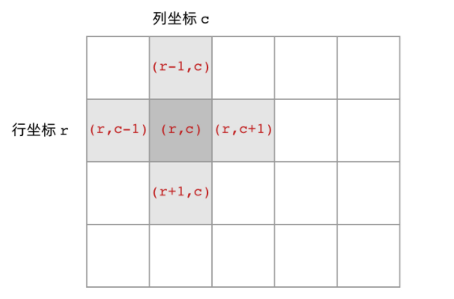

# 岛屿类问题 DFS遍历框架

## 遍历要点
1. 访问相邻节点;上下左右.假设当前位置为 (r,c);  

    上节点坐标(r-1,c)  
    下节点坐标(r+1,c)  
    左节点坐标(r,c-1)  
    右节点坐标(r,c+1)  
    <br />
    
     
*** 
2. 边界
> row不能超过 `grid.length`. col不能超过`grid[0].length`

3. 代码
``` js
    /* LeetCode200
        * 思路: 把grid想象成r x c的网格,使用双层遍历.依次遍历所有的节点.
          当从第一个发现的陆地(1)开始深度遍历,污染他的上下左右.直到没有连接为止.
          因为发现一个就会暴露一块岛屿的位置,所有在遍历过程中,发现几次就说明存在
          几个岛屿.
          发现的条件 grid[r][c] = 1.
          为了避免重复将已经遍历过的陆地(1)进行修改grid[r][c] = 2;
          最后 numsIslands 的次数就是岛屿的个数.
          核心代码: 
            1. 发现陆地grid[r][c]=1,进行深度遍历,查找他的上下左右节点是否存在相连接的陆地.
            2. 统计数 numsIsland 增加.
            2. 将已经污染过的陆地进行着色 grid[r][c] = 2;
            3. 遍历结束,返回 numsIsland.
        */
        var grid = [
            [0, 1, 1, 1, 1],
            [1, 1, 1, 1, 1],
            [0, 1, 1, 0, 1],
            [0, 0, 0, 0, 0],
            [0, 0, 1, 0, 1],
            [0, 1, 0, 0, 1]
        ];

        
        function gridDfs(grid, r, c){
            let row = grid.length;
            let nc = grid[0].length;

            grid[r][c] = 2; // 已经遍历过的

            if(r - 1 >= 0 && grid[r-1][c] == 1){
                gridDfs(grid, r-1, c);
            }
            if (r + 1 < row && grid[r+1][c] == 1){
                gridDfs(grid, r+1, c);
            }
            if(c - 1 >= 0 && grid[r][c-1] == 1){
                gridDfs(grid, r, c-1);
            }
            if(c + 1 < nc && grid[r][c+1] == 1){
                gridDfs(grid, r, c+1);
            }
        }
        function isArea(r, c){
            return 0 <= r && r < grid.length && c >= 0 && c < grid[0].length;
        }

        function numsIsland(grid){
            let row = grid.length;
            if(row.length == 0) return 0;
            let col = grid[0].length;
            let num_islands = 0;
            for (let r = 0; r < row; ++r) {
                for (let c = 0; c < col; ++c) {
                    if (grid[r][c] == 1) { // 找到陆地才会进入循环.直到未找到陆地则会退出dfs
                        ++num_islands;
                        gridDfs(grid, r, c);
                    }
                }
            }
            return num_islands;
        }
        console.log('grid', numsIsland(grid));
```